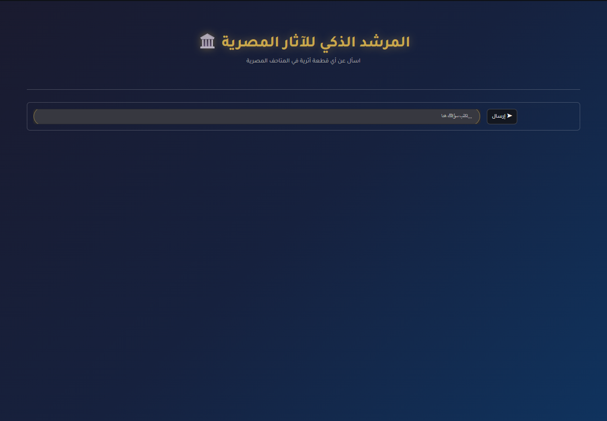
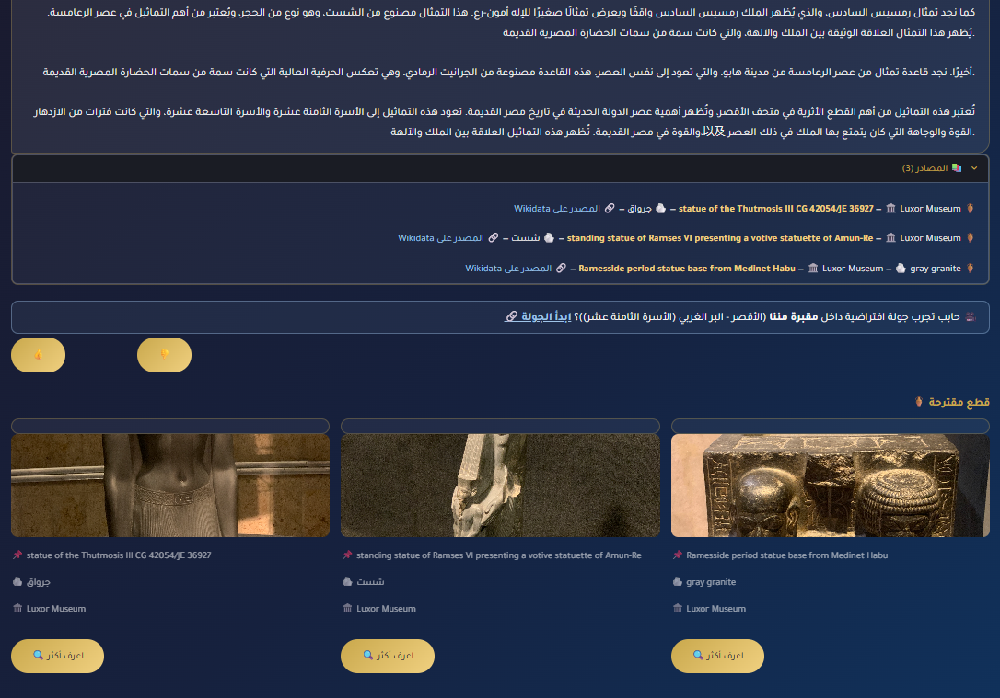

# 🏛️ المرشد الذكي للآثار المصرية | Egyptian Artifacts Assistant

[](https://github.com/wafaashour499/Egyptian-Artifacts-Assistant/actions/workflows/tests.yml)
[](https://www.python.org/)
[](https://streamlit.io)
[](./LICENSE)

نظام **RAG (Retrieval-Augmented Generation)** بيرد على أسئلتك عن القطع الأثرية المصرية القديمة، باللغة العربية أو الإنجليزية، باستخدام بيانات حقيقية من Wikidata ونموذج Llama 3.3 عبر Groq.

A **RAG (Retrieval-Augmented Generation)** system that answers questions about ancient Egyptian artifacts, in Arabic or English, using real data from Wikidata and Llama 3.3 via Groq.

🔗 **جرّب التطبيق مباشرة | Live Demo:** https://egyptian-artifacts-assistant.streamlit.app/

---

## 📸 لقطات من الواجهة | Screenshots

<p align="center">
  
</p>
<p align="center">
  
</p>

---

## 🇪🇬 نظرة عامة

بتسأل بالعربي أو الإنجليزي عن أي قطعة أثرية، ملك، أو متحف، والنظام:
1. بيبحث في قاعدة بيانات القطع الأثرية (متحف القاهرة، الأقصر، النوبة، والمتحف المصري الكبير — البيانات مجمّعة كلها في ملف واحد، التفاصيل في قسم [مصدر البيانات](#-مصدر-البيانات--data-source))
2. بيجيب أقرب القطع المرتبطة بسؤالك (Semantic Search)
3. بيولّد رد متكامل **بنفس لغة سؤالك** (عربي أو إنجليزي)، مبني على البيانات المسترجعة + معرفة الموديل التاريخية

### ✨ المميزات
- 🔍 **بحث دلالي متعدد اللغات** — اسأل بالعربي أو الإنجليزي، النتيجة واحدة
- 🗣️ **رد بنفس لغة السؤال** — تسألي عربي يردّ عربي، تسألي إنجليزي يردّ إنجليزي
- 🌊 **رد Streaming** — الإجابة بتظهر أول بأول بدل الانتظار للرد كامل
- 📚 **مصادر موثّقة** — كل رد معاه قسم "المصادر" برابط مباشر لصفحة القطعة على Wikidata
- 🎥 **جولات افتراضية** — قسم ثابت في الشريط الجانبي بكل الجولات المتاحة (Matterport)، بالإضافة لاقتراح تلقائي للجولة المرتبطة بالقطعة أثناء المحادثة. تقدري كمان تطلبي "اعرض كل الجولات" في أي وقت عشان تشوفيهم كلهم
- 🖼️ **صور محسّنة الأداء** — عرض بنسخة مصغّرة (thumbnail) من Wikimedia بدل الصورة الأصلية كاملة الدقة، مع lazy loading و fallback لو الرابط اتعطل
- 👍 **تقييم المستخدم** — زرار إعجاب/عدم إعجاب تحت كل رد
- 🏺 **قطع مقترحة** — كروت تفاعلية لاستكشاف قطع مشابهة بضغطة زرار
- 🛡️ **حماية الجلسة** — حد أقصى لعدد الأسئلة في الجلسة الواحدة، لتفادي استهلاك مبالغ فيه لـ Groq API

---

## 🇬🇧 Overview

Ask in Arabic or English about any artifact, king, or museum, and the system:
1. Searches the artifacts database (Cairo, Luxor, Nubian, and Grand Egyptian museums — all merged into a single dataset, see [Data Source](#-مصدر-البيانات--data-source))
2. Retrieves the most relevant items via semantic search
3. Generates a complete answer **in the same language as your question** (Arabic or English), grounded in the retrieved data plus the model's historical knowledge

### ✨ Features
- 🔍 **Multilingual semantic search** — ask in Arabic or English, same accurate results
- 🗣️ **Responds in your language** — Arabic questions get Arabic answers, English questions get English answers
- 🌊 **Streaming responses** — answers appear progressively instead of a blocking wait
- 📚 **Cited sources** — every answer includes a collapsible "Sources" section linking directly to the Wikidata entry
- 🎥 **Virtual tours** — a permanent sidebar section lists every available Matterport tour, plus automatic in-chat suggestions when a retrieved artifact matches a toured site. You can also ask to "show all tours" at any time
- 🖼️ **Performance-optimized images** — displays resized Wikimedia thumbnails instead of full-resolution originals, with lazy loading and a graceful fallback for broken links
- 👍 **User feedback** — thumbs up/down on every response
- 🏺 **Suggested artifacts** — interactive cards to explore related pieces with one click
- 🛡️ **Session protection** — a per-session question cap to avoid excessive Groq API usage

---

## 🛠️ التقنيات المستخدمة | Tech Stack

| الطبقة | التقنية |
|---|---|
| الواجهة | [Streamlit](https://streamlit.io) |
| نموذج اللغة | Llama 3.3 70B عبر [Groq API](https://groq.com) |
| الـ Embeddings | `paraphrase-multilingual-MiniLM-L12-v2` (Sentence Transformers) |
| قاعدة بيانات المتجهات | [ChromaDB](https://www.trychroma.com) (Persistent Client) |
| مصدر البيانات | [Wikidata](https://www.wikidata.org) (رخصة CC0) |
| الاختبارات | [pytest](https://pytest.org) |

---

## 📂 هيكل المشروع | Project Structure

```
Egyptian-Artifacts-Assistant/
├── app.py                      # واجهة Streamlit الرئيسية
├── requirements.txt            # المكتبات المباشرة المطلوبة للتشغيل
├── current_versions.txt        # نسخة كاملة من كل المكتبات (بيئة مرجعية معروفة الاستقرار)
├── .env                        # GROQ_API_KEY (غير مرفوع على GitHub)
├── data/
│   ├── egyptian_museum_cairo.json   # الملف المستخدم فعليًا في التطبيق —
│   │                                 # فيه بيانات المتاحف الأربعة كلها مجمّعة
│   ├── gem_artifacts.json           # ملف مصدر خام (raw) — مش بيتقرأ مباشرة من app.py
│   ├── luxor_artifacts.json         # ملف مصدر خام (raw) — مش بيتقرأ مباشرة من app.py
│   ├── nubian_artifacts.json        # ملف مصدر خام (raw) — مش بيتقرأ مباشرة من app.py
│   └── virtual_tours.json           # روابط الجولات الافتراضية
├── src/
│   ├── data_loader.py          # جمع بيانات القطع من Wikidata
│   ├── embeddings.py           # بناء الـ embeddings وقاعدة ChromaDB
│   └── rag.py                  # منطق الاسترجاع + التوليد + الـ streaming
└── tests/
    ├── conftest.py             # إعدادات مشتركة للاختبارات (stubs للمكتبات التقيلة)
    └── test_data_logic.py      # اختبارات وحدة لمنطق البيانات والاسترجاع
```

---

## 🚀 التشغيل محلياً | Run Locally

```bash
# 1) Clone
git clone https://github.com/wafaashour499/Egyptian-Artifacts-Assistant.git
cd Egyptian-Artifacts-Assistant

# 2) بيئة افتراضية | virtual environment
python -m venv venv
source venv/bin/activate   # Windows: venv\Scripts\activate

# 3) المكتبات | dependencies
pip install -r requirements.txt

# 4) ملف الإعدادات | environment file
echo "GROQ_API_KEY=your_key_here" > .env

# 5) تشغيل | run
streamlit run app.py
```

> على Streamlit Community Cloud، حطي `GROQ_API_KEY` في **Secrets** بدل `.env`.
> On Streamlit Community Cloud, add `GROQ_API_KEY` under **Secrets** instead of `.env`.

### 🧪 تشغيل الاختبارات | Running Tests

```bash
pip install -r requirements-dev.txt
pytest tests/
```

---

## 📊 مصدر البيانات | Data Source

البيانات مسحوبة من **Wikidata** (رخصة [CC0](https://creativecommons.org/publicdomain/zero/1.0/) — مفتوحة بالكامل) عبر `src/data_loader.py`، وصور القطع من **Wikimedia Commons**.

البيانات اتجمعت في الأصل من 4 متاحف منفصلة (القاهرة، المتحف المصري الكبير GEM، الأقصر، والنوبة) — كل متحف في ملف JSON مستقل تحت `data/`. بعد كده، القطع الأربعة اتدمجت في ملف واحد (`egyptian_museum_cairo.json`) وهو المصدر الوحيد اللي بيتقرأ فعليًا وقت تشغيل التطبيق (`load_data()` في `src/embeddings.py`). ملفات `gem_artifacts.json` و`luxor_artifacts.json` و`nubian_artifacts.json` متسيبين في الريبو كمصادر خام (raw) للمرجعية والشفافية، لكن مش بيتم قراءتهم مباشرة في مسار التشغيل الحالي.

All data is sourced from **Wikidata** (fully open [CC0](https://creativecommons.org/publicdomain/zero/1.0/) license) via `src/data_loader.py`, with artifact images from **Wikimedia Commons**.

The data was originally collected from 4 separate museums (Cairo, Grand Egyptian Museum, Luxor, and Nubian) — one JSON file per museum under `data/`. These four sets were then merged into a single file (`egyptian_museum_cairo.json`), which is the only file actually read at runtime (`load_data()` in `src/embeddings.py`). The individual `gem_artifacts.json`, `luxor_artifacts.json`, and `nubian_artifacts.json` files remain in the repo as raw sources for reference and transparency, but are not read directly in the current runtime path.

---

## 🤝 المساهمة | Contributing

الـ Pull Requests والاقتراحات مرحّب بيها. لو لقيت مشكلة أو عندك فكرة تحسين، افتح [Issue](../../issues) جديد.

Pull requests and suggestions are welcome. Found a bug or have an idea? Open an [Issue](../../issues).

---

## 📄 الترخيص | License

المشروع مرخّص تحت [MIT License](./LICENSE).

This project is licensed under the [MIT License](./LICENSE).
